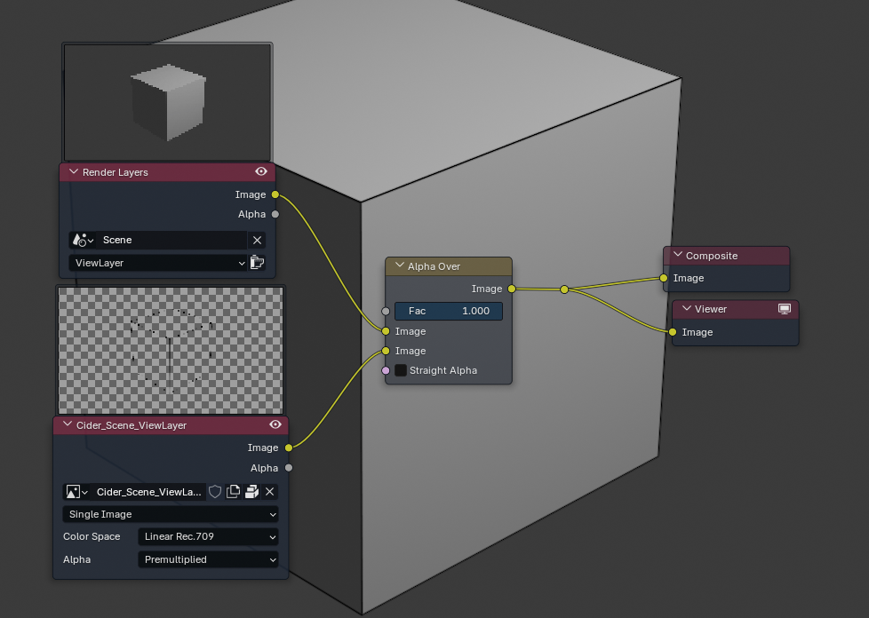
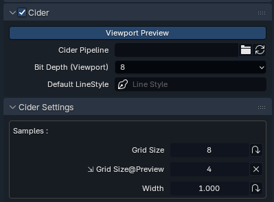
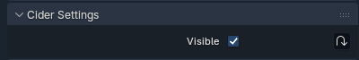
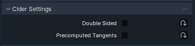
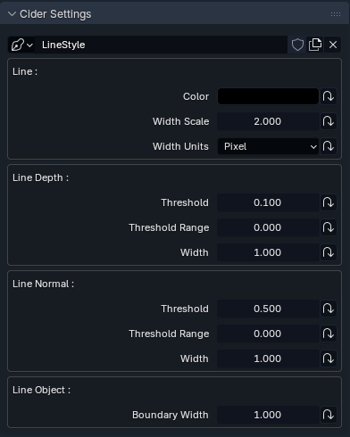
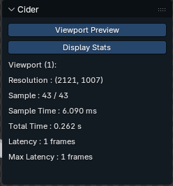

## Install
 
- Go to [the latest Release page](https://github.com/gamingrobot/Cider/releases/tag/cider-latest).
- Download the *Cider* version that matches your OS.
- Open Blender. Go to *Preferences > Addons*, click on the *Install...* button and select *Cider.zip* from your downloads. *(It will take a few seconds)*
- Tick the box in the *Cider* panel to enable it.

## Uninstall

- Untick the box in *Preferences > Addons > BlenderMalt* to disable the addon.
- Restart *Blender*.
- Go back to *Preferences > Addons > BlenderMalt*, expand the panel and click the *Remove* button.

## Usage

- Enable Cider in the Scene settings
- Render scene (Cider will generate a packed image on render)
- Setup compositor nodes:

## Settings

### Scene

- **Viewport Preview** *: ( Bool ) = True*  
>Enables line rendering preview in viewport Render mode.
- **Cider Pipeline**  
>The path to a custom *render pipeline*. If it's empty (the default), the *Line Pipeline* will be used.  
>The button at the right is the *Reload Pipeline* operator, which fully restarts the renderer.  
- **Bit Depth (Viewport)** *: ( Enum ) = 8*   
>The viewport image *bit depth*. Higher *bit depths* can yield better image quality (avoiding *banding* and *clamping*), but can bottleneck your *GPU<->CPU* bandwidth at high resolutions.  
>Final renders are always sent to *Blender* as 32bit images for best quality, regardless of this setting.
- **Default LineStyle** *: ( LineStyle ) = LineStyle*  
>The default LineStyle, used for objects/materials with no LineStyle assigned.
- **Samples**
	- **Grid Size** *: ( Int ) = 8*  
	>The number of render samples per side in the sampling grid. 
The total number of samples is the square of this value minus the samples that fall outside the sampling radius.  
Higher values will provide cleaner renders at the cost of increased render times.
	- **Width** *: ( Float ) = 1.0*  
	>The width (and height) of the sampling grid. 
Larger values will result in smoother/blurrier images while lower values will result in sharper/more aliased ones. 
Keep it withing the 1-2 range for best results.

### Object

- **Visible** *: ( Bool ) = True*  
>Disables object visibility. The object is not rendered, useful for decals.

### Mesh

- **Double Sided** *: ( Bool ) = False*  
>Disables backface culling, so geometry is rendered from both sides.
- **Precomputed Tangents** *: ( Bool ) = False*  
>Load precomputed mesh tangents *(needed for improving normal mapping quality on low poly meshes)*. 
It's disabled by default since it slows down mesh loading in Blender.  
When disabled, the *tangents* are calculated on the fly from the *pixel shader*.

### Material/LineStyle

One LineStyle assigned per Material, if none are specified the "Default LineStyle"  in the Scene settings will be used.

- **Line**
	- **Color** *: ( Color ) = default = (0.0,0.0,0.0,1.0)*  
	- **Width Scale** *: ( Float ) - default = 2.0*  
	- **Width Units** *: ( ENUM(Pixel,Screen,World) ) - default = Pixel*  
- **Line Depth**
	- **Threshold** *: ( Float ) - default = 0.1*  
	- **Threshold Range** *: ( Float ) - default = 0.0*  
	- **Width** *: ( Float ) - default = 1.0*  
- **Line Normal**
	- **Threshold** *: ( Float | Slider ) - default = 0.5*  
	- **Threshold Range** *: ( Float | Slider )*  
	- **Width** *: ( Float ) - default = 1.0*  
- **Line Object**
	- **Boundary Width** *: ( Float ) - default = 1.0*

## View Panel

- **Viewport Preview** *: ( Bool ) = True*  
>Enables line rendering preview in viewport Render mode.
- **Display Stats** *: ( Bool ) = False*  
>Display stats for viewport preview.

## Creating a Custom Pipeline

Same as creating a Malt Pipeline but Material is mapped to LineStyle see [LinePipeline.py](../Cider/LinePipeline.py) for the default pipeline.

## Developer Documentation

[How to setup Cider for Development.](Development.md)
